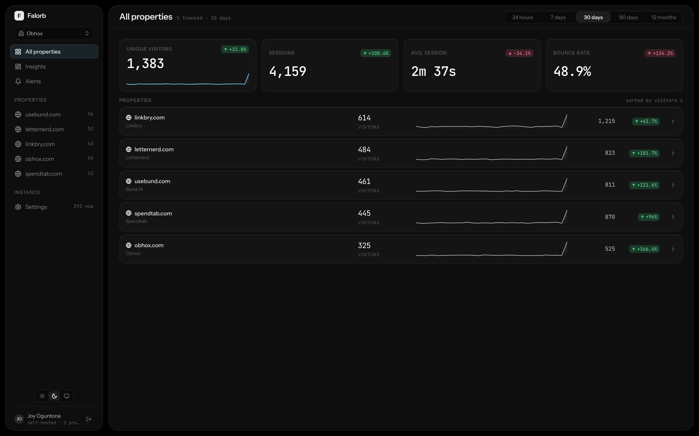
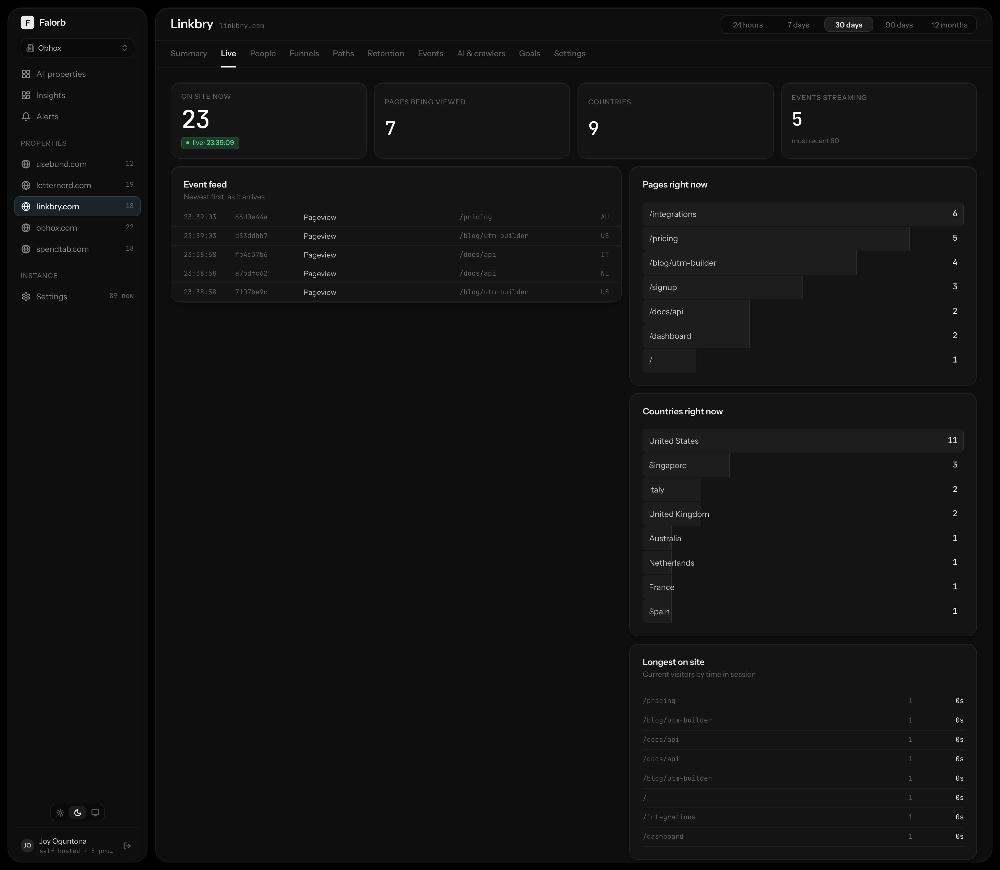
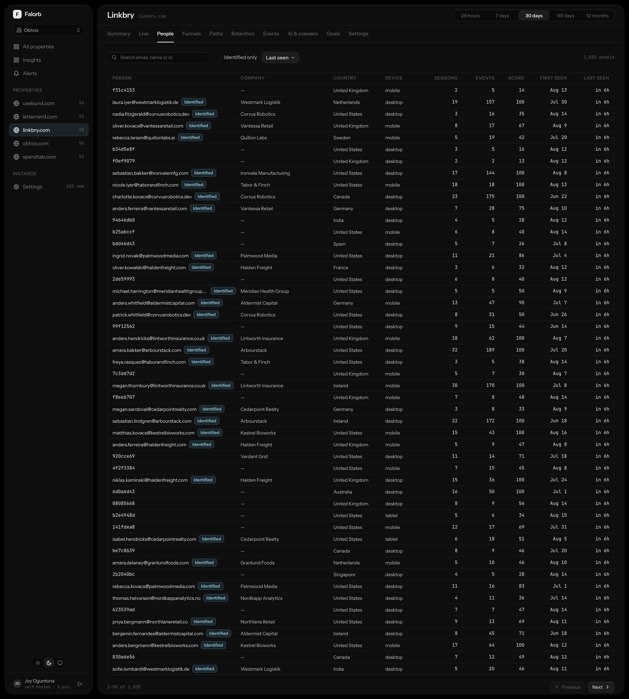
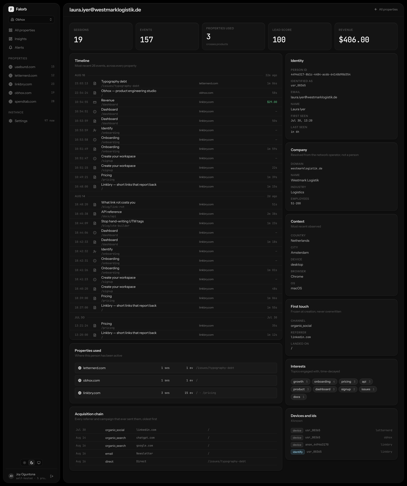
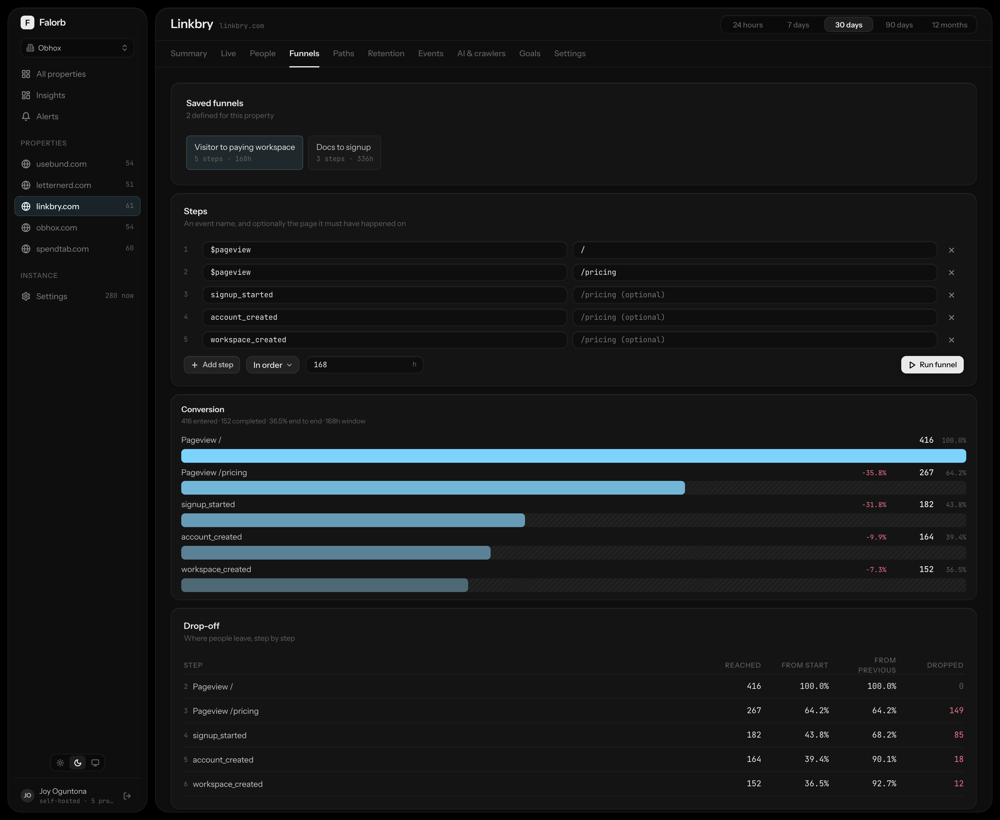
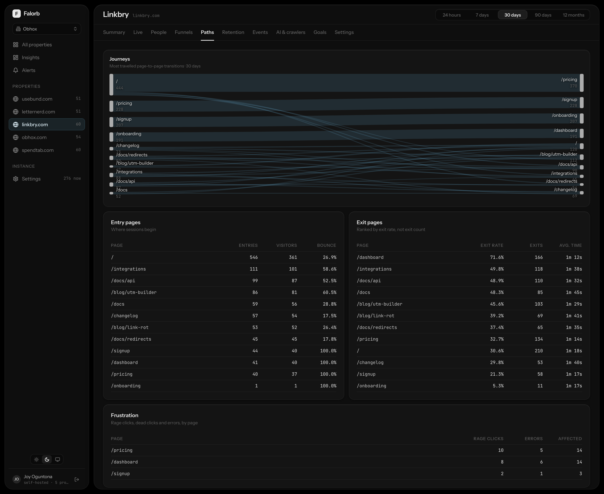
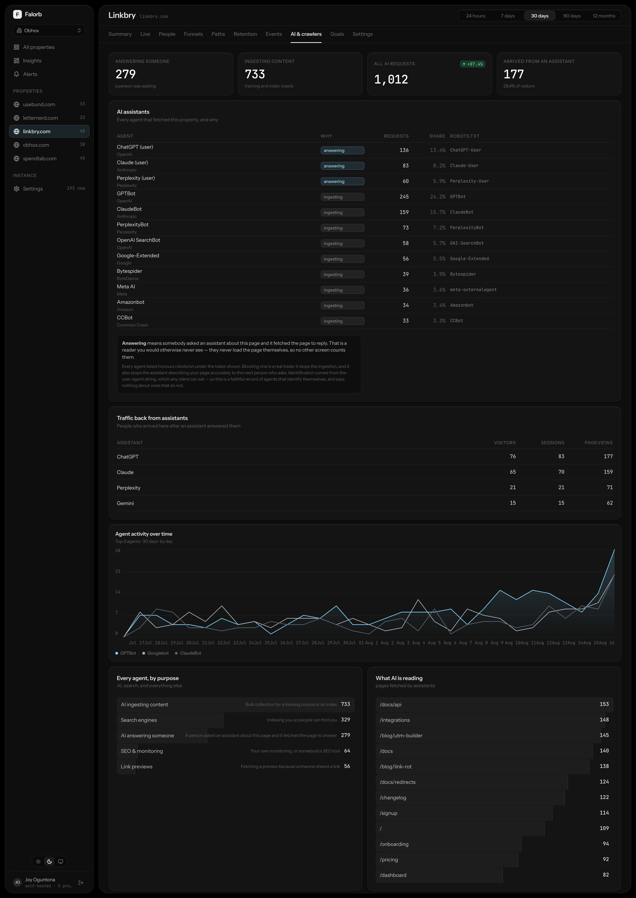
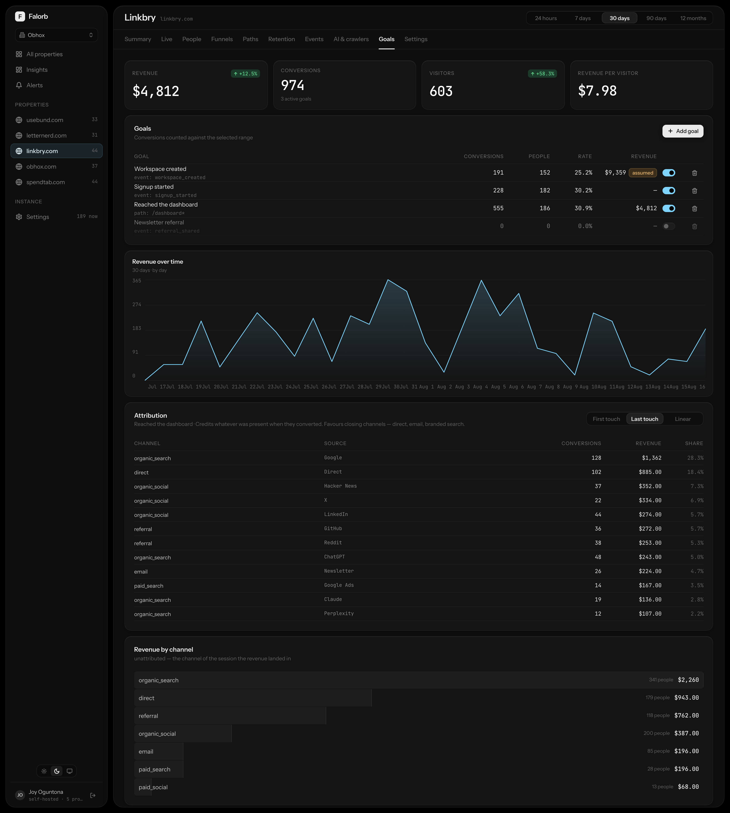
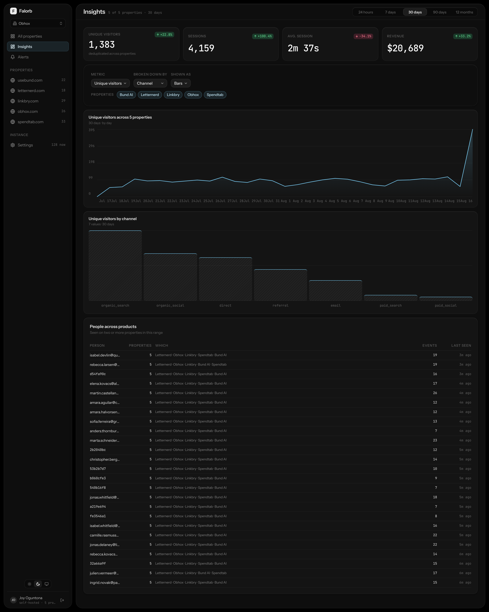

# Falorb

Self-hosted, first-party product analytics for a portfolio of sites. Built for
small-to-medium traffic, person-level detail, and one view across every project.

**Status:** the collection pipeline, storage layer, identity graph, query
layer, background workers, self-serve account system and MCP server are
complete and verified. The dashboard is built — 27 routes, light and dark,
role-enforced, driven end to end by Playwright. It does not yet cover the
whole backend; see [FEATURES.md](FEATURES.md) for the gaps.



## What it does

- **Multi-project** — one deployment, one identity graph, every property in one place.
- **Person-level** — full timeline per visitor, across every product they've touched.
- **Cross-project identity** — answers "which of my other products has this person used".
- **Drop-off** — funnels with per-step loss, exit-rate ranking, page-to-page flows, rage clicks.
- **Enrichment** — acquisition chains, on-site interest profiles, B2B company identification.
- **Referral links** — shareable links, attributed from click through to eventual signup, optionally on your own domain via CNAME.
- **Growth signals** — page-performance and interest-graph insights per property, plus on-demand AI recommendations (via OpenRouter) for content, product gaps, channels, and who to contact.
- **Privacy-first** — no raw IP stored anywhere, GDPR export/erasure, per-project retention.
- **AI-native** — an MCP server (25 tools) so an assistant can query the platform directly, and a dashboard panel tracking what AI crawlers read on your sites.

### Scope boundary

Cross-site tracking of sites you do not own is **not implemented and will not
be**. It requires third-party cookies (dead in modern browsers), persistent
fingerprinting, or purchased data-broker profiles, and is unlawful under
GDPR/ePrivacy without consent. Everything here derives from first-party
activity on properties you operate.

Anonymous visitors are never joined across domains. Identity unifies only on a
deterministic signal: the same `identify()` id on both projects, or a click
through a decorated link between two of your own domains.

## Architecture

```
Browser ──▶ apps/ingest ──▶ Redis Stream ──▶ apps/worker ──┬──▶ ClickHouse   (events)
            (Bun + Hono)                                   └──▶ Postgres     (profiles)
            p99 <10ms                                              ▲
                                          packages/queries ────────┘
                                                 ▲
                          ┌──────────────────────┼──────────────────────┐
                     apps/web                apps/api                apps/mcp
                  (dashboard, Next.js)   (accounts, Bun + Hono)   (MCP server, stdio/HTTP)
                          └──────────────┬───────────┘
                                    packages/auth
                              (better-auth, shared config)
```

Events are immutable and high-volume, so they live in ClickHouse. Person
profiles mutate constantly (merges, traits, interest scores), so they live in
Postgres. Redis sits between ingest and storage so a slow or restarting
ClickHouse never becomes a slow response on someone's website. `apps/web` and
`apps/api` both read through `packages/queries` — no HTTP hop between the
dashboard and the query layer — and share one `better-auth` config from
`packages/auth`, so a session cookie from either mints the same scopes.

| Package | Purpose |
|---|---|
| `packages/core` | Wire format, event schema, UA/referrer/URL parsing |
| `packages/tracker` | Browser script — 2.9 KB gzip, zero dependencies |
| `packages/db` | Drizzle (Postgres) + ClickHouse DDL, migrations, API keys |
| `packages/queries` | Parameterized ClickHouse query builders |
| `packages/auth` | Shared `better-auth` config — sessions, API keys, roles |
| `packages/mailer` | Transactional email (verification, reset, invites, alerts) — Resend or SMTP |
| `packages/ui` | Design system — 32 components, light/dark tokens |
| `packages/sdk-node` | Server-side SDK — non-blocking, never throws, batches by identity |
| `packages/sdk-react` | `<FalorbProvider>`, `useFalorb`, `usePageview`, `useIdentify` |
| `apps/ingest` | Collector: validate, enrich, hash IP, publish |
| `apps/worker` | Stream writer + 11 scheduled derivation jobs |
| `apps/api` | Self-serve accounts — signup, sessions, projects, API keys, team invites |
| `apps/web` | The dashboard — 27 routes, role-enforced, light and dark |
| `apps/mcp` | MCP server — 25 tools, 2 resources, 3 prompts for AI assistants |

## Getting started

```bash
pnpm install
cp .env.example .env          # then set FALORB_SALT_SECRET
docker compose -f infra/docker-compose.yml up -d
pnpm --filter @falorb/db migrate      # Postgres
pnpm --filter @falorb/db ch:migrate   # ClickHouse
pnpm --filter @falorb/db seed         # organization + projects
pnpm --filter @falorb/tracker build
```

Run the services:

```bash
bun apps/ingest/src/index.ts
```

```bash
pnpm --filter @falorb/worker start
```

Run the API and the dashboard, then sign up at `localhost:3000`:

```bash
pnpm --filter @falorb/api dev     # accounts API — port 3003
pnpm --filter @falorb/web dev     # dashboard — port 3000
```

Point an assistant at it over MCP:

```bash
pnpm --filter @falorb/mcp start        # stdio, for Claude Desktop / Claude Code
pnpm --filter @falorb/mcp start:http   # streamable HTTP, bearer API key
```

Install on a site:

```html
<script defer src="https://a.example.com/t.js" data-project="prj_..."></script>
```

```js
falorb.identify(user.id, { email: user.email, plan: user.plan })
falorb.track('checkout_started', { plan: 'pro', seats: 3 })
falorb.revenue(99, 'USD')
```

## Demo workspace

`seed.ts` gives a developer something non-empty to build against. The demo seed
is for showing the product: named people at named companies, saved funnels,
alert history, two workspaces, and enough shape in the data that a trend line
has a trend in it.

```bash
# sign up in the dashboard first, then:
SEED_DEMO_OWNER_EMAIL=you@example.com pnpm --filter @falorb/db seed:demo
```

It builds its own organizations (`acme-demo`, `kestrel-demo`) and is
destructive only to those, so re-running never disturbs the development seed or
a real workspace. Postgres profiles and ClickHouse events are generated from
one model, so a figure on a person's profile is counted from the events its own
timeline renders.

The account ends up a member of two workspaces, which is what makes the
workspace switcher appear at all — it renders as a plain label below that.

The live screen reads a short trailing window, so it is empty within minutes of
any seed. Top it up immediately before looking:

```bash
pnpm --filter @falorb/db seed:live
```

### Screenshots

```bash
pnpm --filter @falorb/web shots
```

Writes `shots/full/{dark,light}` (whole screens) and `shots/cards/{dark,light}`
(single panels, cropped to their own bounds) at 2× against a running dashboard.
The live screen is captured last, because filling its window writes several
hundred events timestamped *now* — which would otherwise appear as a spike on
the final bucket of every trend shot taken afterwards.

## Tour

A walk through the dashboard against a real deployment.

**All properties** — one deployment, every property in one place: unique
visitors, sessions and a per-property sparkline with trend, sorted by traffic.


**Live** — who's on a site right now, and the event feed filling as traffic
arrives. Backed by a 3-second SSE poll, cursor-advanced, self-closing after 30
minutes idle.



**People** — every visitor, identified or anonymous, searchable, with company
and lead score where enrichment resolved one.



**Person profile** — the payoff of the identity graph: one human's full
timeline across every property they've touched, with acquisition chain,
interests, aliases and devices in one view.



**Funnels** — a URL-encoded builder with a per-step drop-off waterfall, so a
falling conversion rate points at the exact step losing people.



**Paths** — page-to-page flows in and out of any page, plus entry, exit and
rage-click reports.



**AI & crawlers** — what ChatGPT, Claude and Perplexity read on your sites,
and what traffic they send back.



**Goals** — conversions, revenue and three attribution models, without
leaving the dashboard for a spreadsheet.



**Insights** — the cross-project view: pick a metric and a dimension, and see
who used more than one of your products.



More screens — retention cohorts, alerts, team and role management, the MCP
connection panel, public share links — are in [FEATURES.md](FEATURES.md#14-dashboard--appsweb).

## Workers

Eleven scheduled jobs, each holding a Redis lock so a second replica adds
throughput without duplicating sweeps.

| Job | Every | Does |
|---|---|---|
| `ch-writer` | continuous | Drains the Redis stream into ClickHouse; ACKs only after the insert is confirmed |
| `identity-resolver` | 1m | Processes `$identify`, merges people, writes `person_overrides` |
| `sessionizer` | 5m | Rolls closed sessions into Postgres profiles, freezes first-touch attribution |
| `path-transitions` | 15m | Rebuilds page-to-page flows (needs `lagInFrame`, so cannot be a materialized view) |
| `segment-counts` | 30m | Caches saved-segment sizes |
| `interest-scorer` | 1h | Rarity-weighted, time-decayed topic interest per person |
| `enrichment` | 6h | Resolves ASN → company for B2B identification |
| `alerts` | 5m | Threshold, anomaly, no-data and error-spike rules |
| `data-requests` | 2m | GDPR export and erasure |
| `retention` | 12h | Per-project retention, orphan pruning |
| `optimize` | 6h | Forces aggregate merges |

Run them all once, against live data:

```bash
pnpm --filter @falorb/worker verify:jobs
node scripts/loadtest.mjs --events 3000    # asserts zero event loss
```

Backfill profiles from history (watermarks only move forward, so this is
needed after an import or a first deploy onto existing traffic):

```bash
pnpm --filter @falorb/worker backfill --days 90
```

## Privacy

- **No raw IP is stored anywhere.** Ingest hashes it with a daily-rotating salt
  and discards the original before an event is constructed. The hash cannot be
  correlated across days, or across projects.
- **Company identification keys on ASN, not IP.** An ASN identifies a network
  operator, not a person, so no personal data leaves the ingest process.
  Consumer ISP and hosting ASNs are filtered out explicitly.
- **Cookieless mode** stores nothing client-side; identity is a daily-rotating
  hash. Avoids a consent banner in most EU cases.
- **DNT and GPC** are respected by default.
- **Erasure cascades** across both stores and tombstones the profile, so the
  same device id cannot silently resurrect it.
- Form submissions record the form's identity only — **never field values**.

## Verification

```bash
pnpm -r typecheck              # 15 packages
pnpm -r test                   # 101 unit tests
pnpm --filter @falorb/tracker size    # fails the build over 3 KB gzip
pnpm --filter @falorb/queries smoke   # 32 queries against live ClickHouse
pnpm --filter @falorb/worker verify:jobs
node scripts/loadtest.mjs --events 3000    # asserts zero event loss
```

Backfill profiles from history (watermarks only move forward, so this is
needed after an import or a first deploy onto existing traffic):

```bash
pnpm --filter @falorb/worker backfill --days 90
```

`packages/db/src/seed-events.ts` generates a deterministic multi-day,
multi-project dataset with realistic funnel decay and cohort behaviour —
uniform random data makes every report look flat and hides real bugs.

## Things worth knowing before changing this

Each of these cost real debugging time and is easy to reintroduce.

- **Never alias an aggregate to a column name.** `any(project_id) AS project_id`
  makes ClickHouse resolve the `WHERE` reference to the alias and reject the
  query. Aggregate under a suffixed name in a subquery and rename outside.
- **`windowFunnel` rejects `DateTime64`.** Always pass `toDateTime(timestamp)`.
- **Watermarks must key on `ingested_at`, not `timestamp`.** The tracker batches
  and beacons on exit, so an event's client timestamp can be far behind its
  arrival; an event-time watermark silently steps over late arrivals.
- **`wait_for_async_insert: 0` hides insert errors.** A malformed batch returns
  200 and vanishes. Keep it at 1.
- **Aggregate states must match the aggregate's return type.**
  `sum(Decimal64(4))` widens to `Decimal(38,4)`, so the column is `Decimal128(4)`.
- **A materialized view only sees the block being inserted.** Anything needing
  the previous row of a session must be a scheduled job.
- **Use a `Map` for SQL allow-lists.** With an object literal,
  `FIELDS["__proto__"]` is truthy and passes a lookup-based check.
